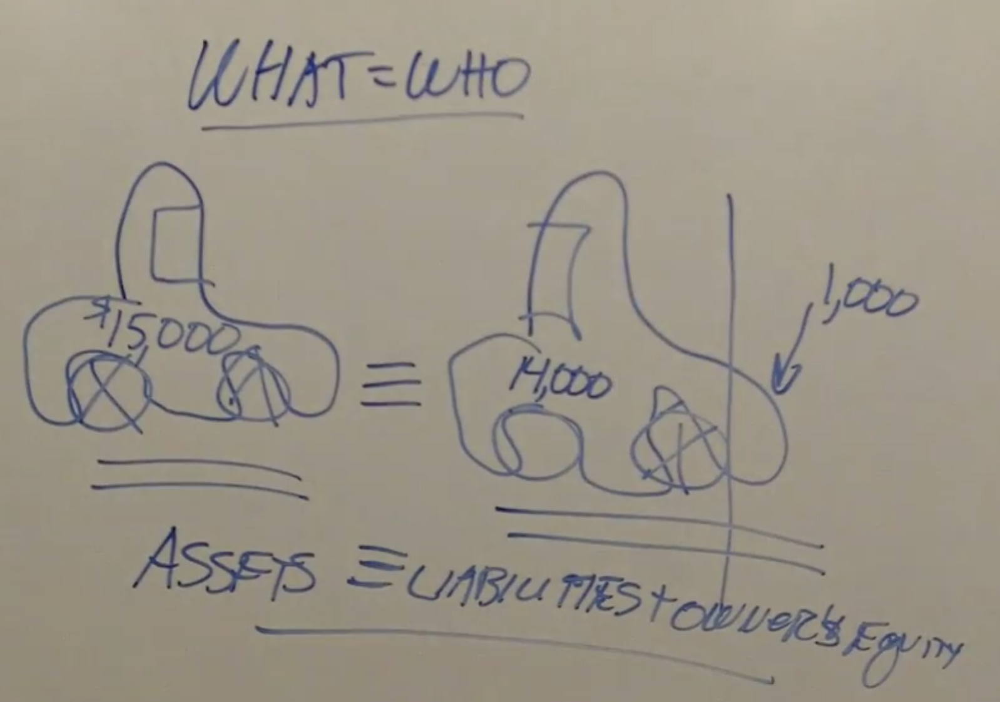
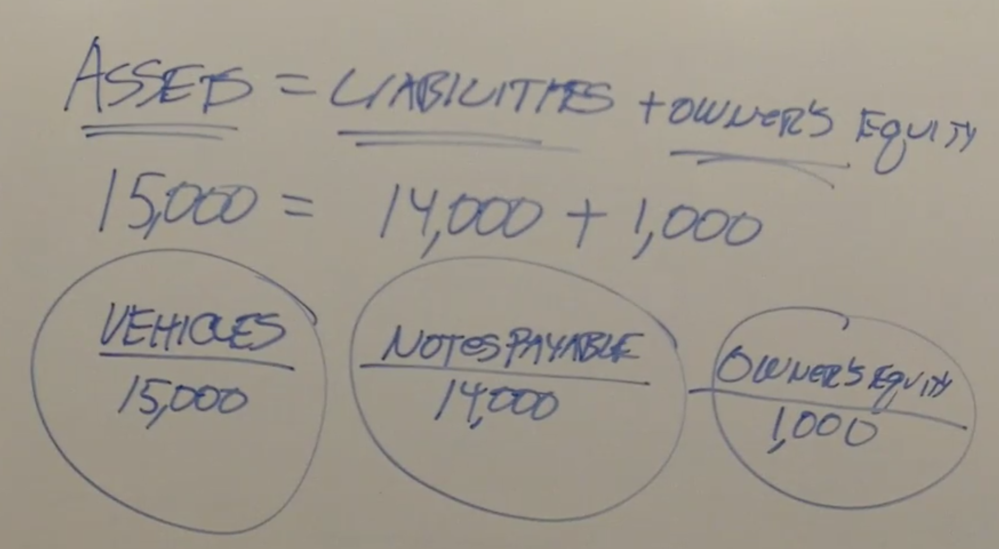
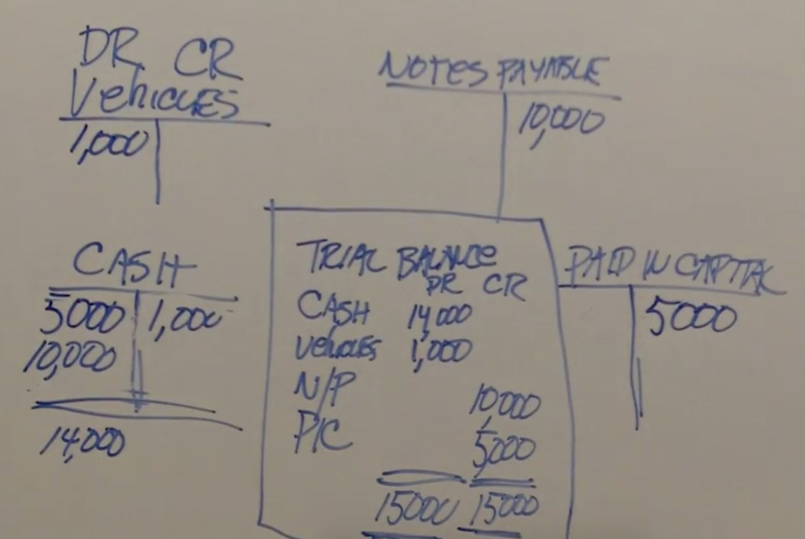
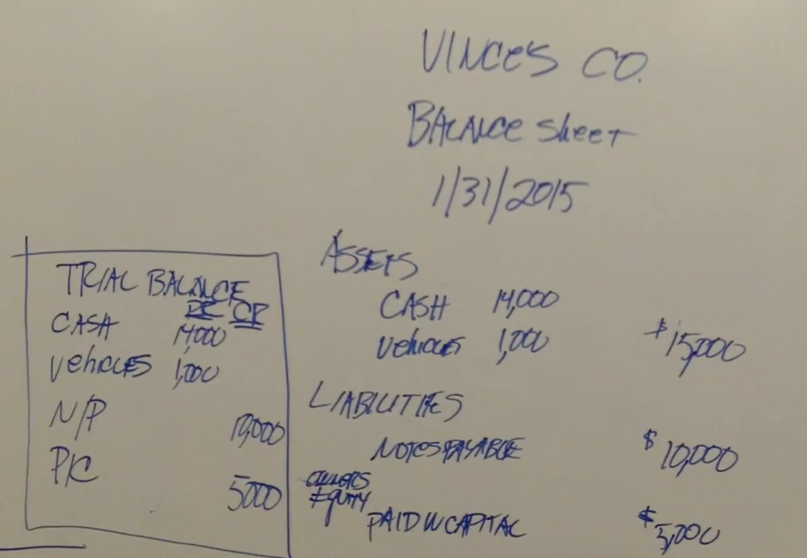
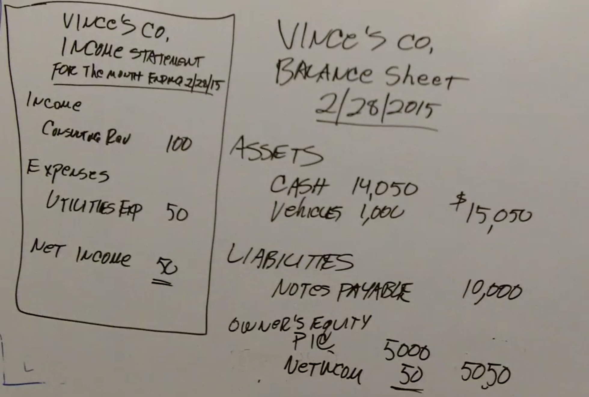
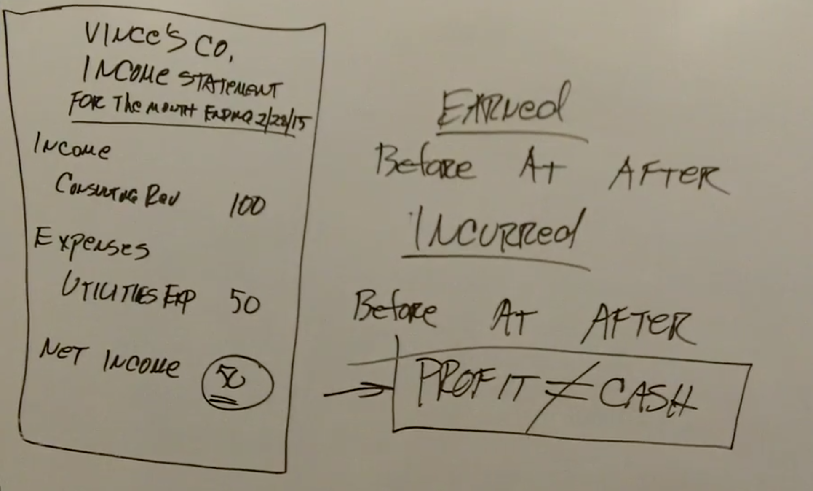

# Accounting in 60 Minutes - A Brief Introduction

## What = Who
- What = Who
- Stuff = Who
- Assets = Who has claim
- Assets = Other's claims + my claims
- Assets = Liability + my claims
- Assets = Liability + Equity

## Let's buy a car

## Some practice entries

## Debits = Credits

## The Trial Balance

## The Balance Sheet

## Income Accounts

## Net Income

## The Income Statement

## It's all about timing

## Income does not equal cash

## Expense and timing

## Conclusion

